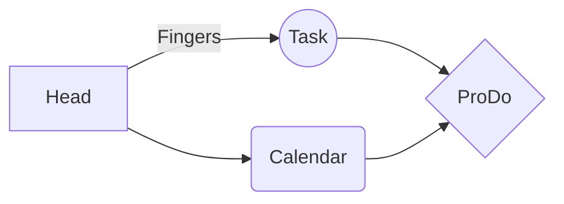

# ProDo

We should write some cool stuff here probably

```bash
codeblock
```

[link](https://github.com/domody/prodo)
[`link in codeblock`](https://github.com/domody/prodo)

## Subtitle

> Cool ass indent

test it owrks from school pc

**Bold**

- Bullet Point

Cool table
SmartyPants converts ASCII punctuation characters into "smart" typographic punctuation HTML entities. For example:

|                  | ASCII                           | HTML                          |
| ---------------- | ------------------------------- | ----------------------------- |
| Single backticks | `'Isn't this fun?'`             | 'Isn't this fun?'             |
| Quotes           | `"Isn't this fun?"`             | "Isn't this fun?"             |
| Dashes           | `-- is en-dash, --- is em-dash` | -- is en-dash, --- is em-dash |


